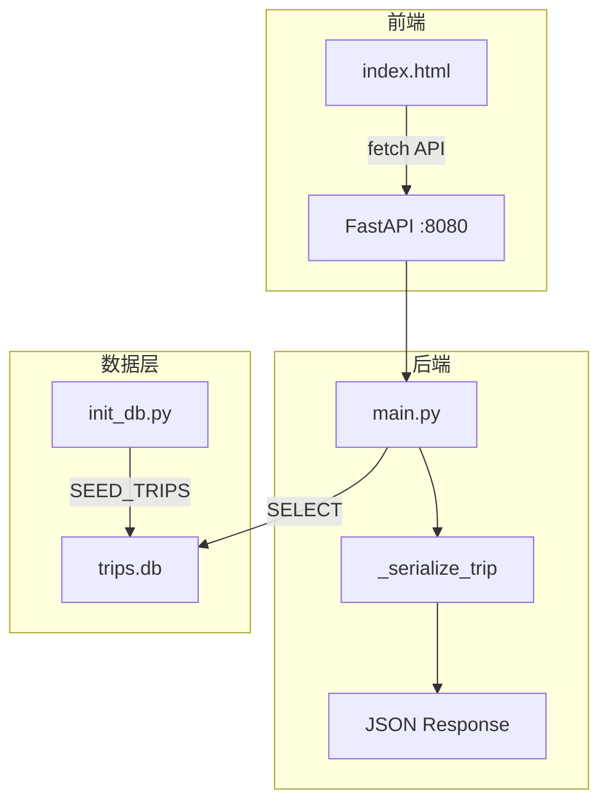

# Vibe Trip — 100种不可思议旅行

> 不是为了逃离生活，而是为了不让生活逃离我们。每一处风景，都是一种情绪的答案。

一款以「情绪价值」为核心的旅行灵感发现平台。通过情绪标签筛选，让用户找到与此刻心境共鸣的旅行目的地。

---

## 技术选型

| 层级 | 技术 | 说明 |
|---|---|---|
| **前端** | HTML + Tailwind CSS (CDN) | 零构建工具，纯静态页面 |
| **前端交互** | 原生 JavaScript (fetch API) | 无框架依赖，轻量直接 |
| **后端** | Python FastAPI | 高性能异步框架，自动生成 OpenAPI 文档 |
| **数据库** | SQLite | 零运维单文件数据库，适合 MVP |
| **服务器** | Uvicorn | ASGI 服务器，FastAPI 标准搭配 |
| **测试** | pytest + FastAPI TestClient | 单元测试 + 接口集成测试 |
| **图片资源** | Unsplash | 高质量免费旅行摄影图 |

### 架构图



---

## 项目结构

```
vibe-trip-app/
├── index.html              # 前端页面（Tailwind CSS + 原生 JS）
├── schema-design.md        # Schema 设计文档（SDD 契约）
├── README.md               # 本文件
├── docs/
│   ├── PRD.md              # 产品需求文档
│   ├── ER.md               # 数据模型与 ER 图
│   └── API.md              # API 接口文档
└── backend/
    ├── main.py             # FastAPI 后端入口
    ├── init_db.py          # 数据库初始化脚本（种子数据）
    ├── test_main.py        # 测试代码（16 个用例）
    ├── e2e_test.py         # 端到端测试
    └── trips.db            # SQLite 数据库文件（运行后生成）
```

---

## 快速开始

### 环境要求

- Python 3.10+
- pip

### 1. 安装依赖

```bash
pip install fastapi uvicorn pytest
```

### 2. 初始化数据库

```bash
python backend/init_db.py
```

输出：

```
数据库初始化完成: e:\vibe-trip-app\backend\trips.db
已插入 5 条旅行地数据
```

### 3. 启动后端服务

```bash
python backend/main.py
```

输出：

```
INFO:     Uvicorn running on http://127.0.0.1:8080 (Press CTRL+C to quit)
```

### 4. 打开前端页面

直接在浏览器中打开 `index.html`，或使用任意静态服务器：

```bash
# 方式一：Python 内置 HTTP 服务器
python -m http.server 3000

# 方式二：VS Code Live Server 插件
# 右键 index.html → Open with Live Server
```

访问 `http://localhost:3000` 即可看到旅行卡片。

### 5. 运行测试

```bash
python -m pytest backend/test_main.py -v
```

输出：

```
16 passed in 1.42s
```

---

## API 接口

### 获取全部旅行地

```bash
curl http://127.0.0.1:8080/api/trips
```

### 按标签筛选

```bash
curl http://127.0.0.1:8080/api/trips?tag=hotspring
curl http://127.0.0.1:8080/api/trips?tag=aurora
curl http://127.0.0.1:8080/api/trips?tag=island
```

### 响应格式

```json
{
  "items": [
    {
      "id": 1,
      "name": "冰岛蓝湖",
      "slug": "iceland-blue-lagoon",
      "description": "火山岩环绕的地热温泉...",
      "emotion_description": "在硫磺与蒸汽中感受地球的呼吸",
      "cover_image_url": "https://images.unsplash.com/...",
      "country": "冰岛",
      "region": "格林达维克",
      "latitude": 63.8804,
      "longitude": -22.4495,
      "best_season": "9月-次年5月",
      "is_featured": true,
      "tags": [
        {"id": 1, "name": "温泉", "slug": "hotspring", "color": "#4ECDC4", "icon": "♨️"},
        {"id": 2, "name": "极光", "slug": "aurora", "color": "#A8E6CF", "icon": "🌌"}
      ],
      "created_at": "2026-04-27T10:00:00Z",
      "updated_at": "2026-04-27T10:00:00Z"
    }
  ],
  "total": 5
}
```

> 完整 API 文档见 [docs/API.md](docs/API.md)

---

## 后台管理

### 数据库管理

MVP 阶段无 CMS 后台，数据管理通过以下方式：

| 操作 | 方式 |
|---|---|
| 初始化/重置数据 | `python backend/init_db.py` |
| 查看数据 | 使用 DB Browser for SQLite 打开 `backend/trips.db` |
| 修改种子数据 | 编辑 `backend/init_db.py` 中的 `SEED_TRIPS` |

### 后台账号

MVP 阶段未实现用户认证系统，暂无后台账号。后续迭代规划：

| 阶段 | 功能 | 状态 |
|---|---|---|
| v1.0 | 只读 API，无认证 | ✅ 当前 |
| v2.0 | JWT 认证 + CMS 后台 | 📋 规划中 |
| v2.0 | 管理员账号: `admin` / 默认密码: 待配置 | 📋 规划中 |

---

## 测试覆盖

| 分类 | 测试用例 | 数量 |
|---|---|---|
| 基础功能 | 标签筛选、空结果、全量返回、多标签匹配 | 4 |
| Schema 对齐 | 字段完整性、布尔类型、URL 非空、浮点数、ISO 时间 | 5 |
| 响应结构 | items/total 存在性、total 一致性 | 2 |
| 数据一致性 | slug 唯一、情绪文案非空、国家非空、季节非空、精选标记 | 5 |
| **合计** | | **16** |

---

## 文档索引

| 文档 | 路径 | 说明 |
|---|---|---|
| 产品需求文档 | [docs/PRD.md](docs/PRD.md) | 功能需求、用户故事、迭代规划 |
| 数据模型文档 | [docs/ER.md](docs/ER.md) | ER 图、字段说明、数据流图 |
| API 接口文档 | [docs/API.md](docs/API.md) | 接口契约、请求/响应示例 |
| Schema 设计文档 | [schema-design.md](schema-design.md) | SDD 契约、建表 SQL、ADR |

---

## 种子数据

| # | 名称 | 国家 | 情绪文案 | 标签 |
|---|---|---|---|---|
| 1 | 冰岛蓝湖 | 冰岛 | 在硫磺与蒸汽中感受地球的呼吸 | 温泉、极光 |
| 2 | 马尔代夫水上屋 | 马尔代夫 | 在印度洋的摇篮里听见自己的心跳 | 海岛 |
| 3 | 瑞士阿尔卑斯徒步 | 瑞士 | 每一步都是与山神的对话 | 徒步、极光 |
| 4 | 京都岚山竹林 | 日本 | 在竹影婆娑中听见风的声音 | 文化、自然 |
| 5 | 撒哈拉沙漠星空露营 | 摩洛哥 | 在宇宙的幕布下，重新认识自己 | 沙漠、极光 |

---

## 版本记录

| 版本 | 日期 | 说明 |
|---|---|---|
| v0.1 | 2026-04-27 | MVP 静态页面 + Mock 数据 |
| v1.0 | 2026-04-27 | FastAPI 后端 + SQLite + 全链路联调 + Glassmorphism 视觉 |
