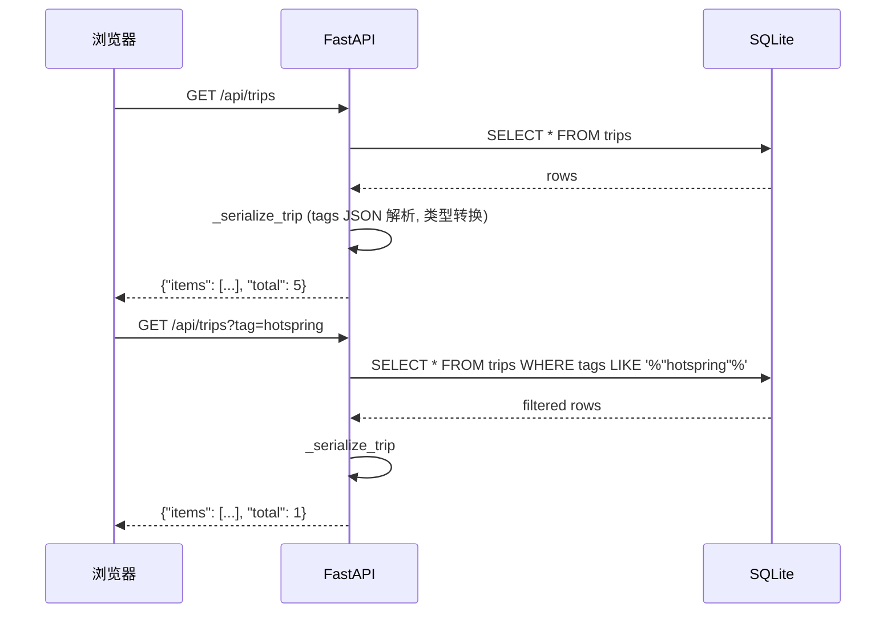

# Vibe Trip — API 接口文档

> 版本: v1.0 | 日期: 2026-04-27 | Base URL: `http://127.0.0.1:8080`

---

## 1. 接口总览

| 方法 | 路径 | 说明 | 状态 |
|---|---|---|---|
| `GET` | `/api/trips` | 旅行地列表（支持标签筛选） | ✅ 已实现 |
| `GET` | `/api/trips?tag={slug}` | 按标签筛选旅行地 | ✅ 已实现 |
| `GET` | `/api/trips/{slug}` | 旅行地详情 | 📋 规划中 |
| `GET` | `/api/tags` | 全部标签列表 | 📋 规划中 |
| `GET` | `/api/featured` | 首页精选旅行地 | 📋 规划中 |

---

## 2. 已实现接口

### 2.1 GET /api/trips

获取旅行地列表，支持通过标签筛选。

**请求**

```
GET /api/trips
GET /api/trips?tag=hotspring
```

**Query Parameters**

| 参数 | 类型 | 必填 | 默认值 | 说明 |
|---|---|---|---|---|
| `tag` | string | 否 | `null` | 标签 slug，如 `hotspring`、`aurora`、`island` |

**成功响应 `200 OK`**

```json
{
  "items": [
    {
      "id": 1,
      "name": "冰岛蓝湖",
      "slug": "iceland-blue-lagoon",
      "description": "火山岩环绕的地热温泉，奶蓝色的水面上升腾着朦胧蒸汽。",
      "emotion_description": "在硫磺与蒸汽中感受地球的呼吸",
      "cover_image_url": "https://images.unsplash.com/photo-1610623532431-94a3f48c0c56?q=80&w=1920&auto=format&fit=crop",
      "country": "冰岛",
      "region": "格林达维克",
      "latitude": 63.8804,
      "longitude": -22.4495,
      "best_season": "9月-次年5月",
      "is_featured": true,
      "tags": [
        {
          "id": 1,
          "name": "温泉",
          "slug": "hotspring",
          "color": "#4ECDC4",
          "icon": "♨️"
        },
        {
          "id": 2,
          "name": "极光",
          "slug": "aurora",
          "color": "#A8E6CF",
          "icon": "🌌"
        }
      ],
      "created_at": "2026-04-27T10:00:00Z",
      "updated_at": "2026-04-27T10:00:00Z"
    }
  ],
  "total": 5
}
```

**响应字段说明**

| 字段 | 类型 | 说明 |
|---|---|---|
| `items` | array | 旅行地列表 |
| `total` | integer | 符合条件的旅行地总数 |
| `items[].id` | integer | 主键 |
| `items[].name` | string | 旅行地名称 |
| `items[].slug` | string | URL 标识 |
| `items[].description` | string \| null | 客观简介 |
| `items[].emotion_description` | string \| null | 情绪文案（核心字段） |
| `items[].cover_image_url` | string \| null | 封面图 URL |
| `items[].country` | string \| null | 国家 |
| `items[].region` | string \| null | 地区/城市 |
| `items[].latitude` | float \| null | 纬度 |
| `items[].longitude` | float \| null | 经度 |
| `items[].best_season` | string \| null | 最佳旅行季节 |
| `items[].is_featured` | boolean | 是否精选 |
| `items[].tags` | array | 标签列表 |
| `items[].tags[].id` | integer | 标签 ID |
| `items[].tags[].name` | string | 标签名称 |
| `items[].tags[].slug` | string | 标签 slug |
| `items[].tags[].color` | string | 前端色值 |
| `items[].tags[].icon` | string | Emoji 图标 |
| `items[].created_at` | string | 创建时间 ISO 8601 |
| `items[].updated_at` | string | 更新时间 ISO 8601 |

**筛选示例**

```bash
# 获取全部旅行地
curl http://127.0.0.1:8080/api/trips

# 筛选温泉相关
curl http://127.0.0.1:8080/api/trips?tag=hotspring

# 筛选极光相关
curl http://127.0.0.1:8080/api/trips?tag=aurora
```

**筛选逻辑**

`tag` 参数使用 `LIKE` 模糊匹配 `tags` JSON 字段中的 slug 值：

```sql
SELECT * FROM trips WHERE tags LIKE '%"hotspring"%'
```

**错误响应**

| 状态码 | 场景 | 响应体 |
|---|---|---|
| 500 | 数据库未初始化 | FastAPI 默认错误 |

---

## 3. 规划中接口

### 3.1 GET /api/trips/{slug}

获取单个旅行地详情。

**Path Parameters**

| 参数 | 类型 | 说明 |
|---|---|---|
| `slug` | string | 旅行地 URL 标识 |

**预期响应 `200 OK`**

```json
{
  "id": 1,
  "name": "冰岛蓝湖",
  "slug": "iceland-blue-lagoon",
  "description": "火山岩环绕的地热温泉...",
  "emotion_description": "在硫磺与蒸汽中感受地球的呼吸",
  "cover_image_url": "https://...",
  "country": "冰岛",
  "region": "格林达维克",
  "latitude": 63.8804,
  "longitude": -22.4495,
  "best_season": "9月-次年5月",
  "is_featured": true,
  "tags": [...],
  "images": [
    {
      "id": 1,
      "image_url": "https://...",
      "caption": "黄昏时分的蓝湖",
      "sort_order": 0,
      "is_primary": true
    }
  ],
  "created_at": "2026-04-27T10:00:00Z",
  "updated_at": "2026-04-27T10:00:00Z"
}
```

**预期错误响应**

| 状态码 | 说明 |
|---|---|
| `404` | 旅行地不存在 |

### 3.2 GET /api/tags

获取全部标签列表。

**预期响应 `200 OK`**

```json
{
  "items": [
    {
      "id": 1,
      "name": "温泉",
      "slug": "hotspring",
      "category": "nature",
      "color": "#4ECDC4",
      "icon": "♨️",
      "trip_count": 8
    }
  ],
  "total": 7
}
```

### 3.3 GET /api/featured

获取首页精选旅行地。

**Query Parameters**

| 参数 | 类型 | 必填 | 默认值 | 说明 |
|---|---|---|---|---|
| `limit` | int | 否 | 6 | 返回数量，1-20 |

**预期响应 `200 OK`**

```json
{
  "items": [...],
  "total": 3
}
```

---

## 4. CORS 配置

当前 MVP 阶段允许所有来源跨域访问：

```python
app.add_middleware(
    CORSMiddleware,
    allow_origins=["*"],
    allow_credentials=True,
    allow_methods=["*"],
    allow_headers=["*"],
)
```

> 生产环境应限制 `allow_origins` 为前端域名。

---

## 5. 请求流程图



---

## 6. 版本记录

| 版本 | 日期 | 说明 |
|---|---|---|
| v1.0 | 2026-04-27 | 初始 API 文档，覆盖已实现和规划中接口 |
