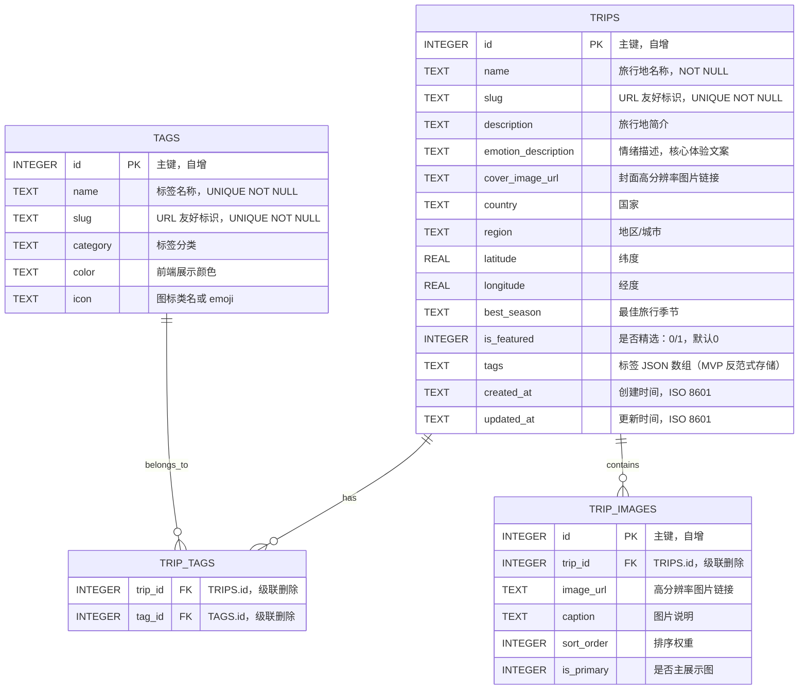
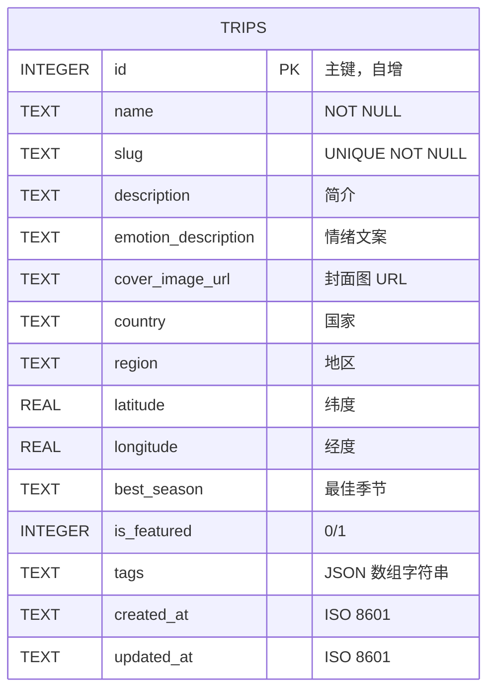
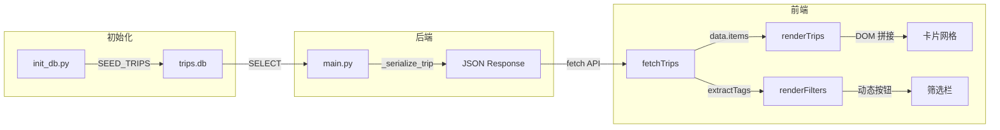

# Vibe Trip — 数据模型与 ER 图

> 版本: v1.0 | 日期: 2026-04-27 | 与 `schema-design.md` 严格对齐

---

## 1. ER 关系图



---

## 2. 当前 MVP 实现（反范式）

> MVP 阶段为降低复杂度，`tags` 字段以 JSON 字符串直接存储在 `trips` 表中，而非使用 `trip_tags` 关联表。



**tags 字段存储格式**：

```json
[
  {"id": 1, "name": "温泉", "slug": "hotspring", "color": "#4ECDC4", "icon": "♨️"},
  {"id": 2, "name": "极光", "slug": "aurora", "color": "#A8E6CF", "icon": "🌌"}
]
```

---

## 3. 字段详细说明

### 3.1 trips 表

| 字段 | 类型 | 约束 | 业务说明 | 示例 |
|---|---|---|---|---|
| `id` | INTEGER | PK, AUTOINCREMENT | 主键 | `1` |
| `name` | TEXT | NOT NULL | 旅行地名称 | `"冰岛蓝湖"` |
| `slug` | TEXT | UNIQUE, NOT NULL | URL 标识 | `"iceland-blue-lagoon"` |
| `description` | TEXT | — | 客观简介（≤200字） | `"火山岩环绕的地热温泉..."` |
| `emotion_description` | TEXT | — | **核心字段**：情绪文案 | `"在硫磺与蒸汽中感受地球的呼吸"` |
| `cover_image_url` | TEXT | — | 封面图 CDN 链接 | `"https://images.unsplash.com/..."` |
| `country` | TEXT | — | 国家，用于区域筛选 | `"冰岛"` |
| `region` | TEXT | — | 地区/城市 | `"格林达维克"` |
| `latitude` | REAL | — | GPS 纬度 | `63.8804` |
| `longitude` | REAL | — | GPS 经度 | `-22.4495` |
| `best_season` | TEXT | — | 最佳旅行季节 | `"9月-次年5月"` |
| `is_featured` | INTEGER | DEFAULT 0, CHECK(0,1) | 是否精选推荐 | `1` |
| `tags` | TEXT | — | 标签 JSON 数组 | `'[{"id":1,...}]'` |
| `created_at` | TEXT | DEFAULT datetime('now') | 创建时间 ISO 8601 | `"2026-04-27T10:00:00Z"` |
| `updated_at` | TEXT | DEFAULT datetime('now') | 更新时间 ISO 8601 | `"2026-04-27T10:00:00Z"` |

### 3.2 tags JSON 内嵌结构

| 字段 | 类型 | 说明 | 示例 |
|---|---|---|---|
| `id` | int | 标签 ID | `1` |
| `name` | str | 标签中文名 | `"温泉"` |
| `slug` | str | URL 标识 | `"hotspring"` |
| `color` | str | 前端 UI 色值 | `"#4ECDC4"` |
| `icon` | str | Emoji 图标 | `"♨️"` |

---

## 4. 数据流图



---

## 5. 索引策略

| 表 | 索引 | 字段 | 用途 |
|---|---|---|---|
| `trips` | `idx_trips_slug` | `slug` | 详情页 slug 查询 |
| `trips` | `idx_trips_featured` | `is_featured` | 精选列表查询 |
| `trips` | `idx_trips_country` | `country` | 国家筛选 |

> MVP 阶段 `tags` 使用 `LIKE` 模糊匹配，暂不建索引。后续迁移至关联表后使用 JOIN 查询。

---

## 6. 种子数据概览

| ID | 名称 | 国家 | 精选 | 标签 |
|---|---|---|---|---|
| 1 | 冰岛蓝湖 | 冰岛 | ✅ | 温泉、极光 |
| 2 | 马尔代夫水上屋 | 马尔代夫 | ✅ | 海岛 |
| 3 | 瑞士阿尔卑斯徒步 | 瑞士 | — | 徒步、极光 |
| 4 | 京都岚山竹林 | 日本 | ✅ | 文化、自然 |
| 5 | 撒哈拉沙漠星空露营 | 摩洛哥 | — | 沙漠、极光 |

---

## 7. 版本记录

| 版本 | 日期 | 说明 |
|---|---|---|
| v1.0 | 2026-04-27 | 初始数据模型，含 ER 图、字段说明、数据流图 |
