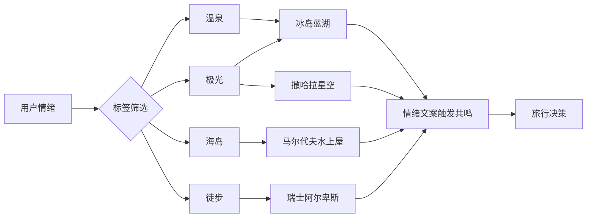
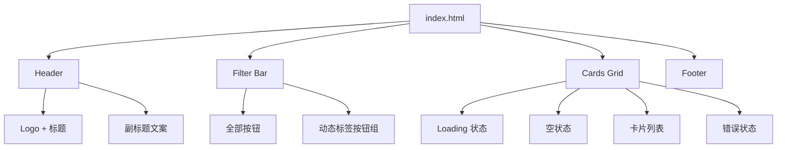

# Vibe Trip — 产品需求文档 (PRD)

> 版本: v1.0 | 日期: 2026-04-27 | 状态: MVP

---

## 1. 产品概述

### 1.1 产品定位

**Vibe Trip** 是一款以「情绪价值」为核心的旅行灵感发现平台。区别于传统 OTA 的价格/日期驱动模式，Vibe Trip 让用户通过「此刻的心情」来发现下一个旅行目的地。

### 1.2 一句话描述

> 不是为了逃离生活，而是为了不让生活逃离我们。每一处风景，都是一种情绪的答案。

### 1.3 目标用户

| 用户画像 | 场景 | 核心诉求 |
|---|---|---|
| 都市白领 | 加班后刷手机解压 | 快速获得「我想去」的冲动 |
| 文艺青年 | 寻找有故事感的旅行地 | 情绪共鸣 > 实用信息 |
| 旅行规划者 | 为假期寻找灵感 | 浏览、收藏、筛选 |

### 1.4 核心价值主张



---

## 2. 功能需求

### 2.1 MVP 功能清单

| 编号 | 功能模块 | 优先级 | 说明 |
|---|---|---|---|
| F-01 | 旅行地卡片列表 | P0 | 展示所有旅行地，含封面图、名称、情绪文案、标签 |
| F-02 | 情绪标签筛选 | P0 | 点击标签按钮，按情绪类型筛选旅行地 |
| F-03 | 精选标记 | P0 | 首页精选旅行地显示 ✨ 精选徽章 |
| F-04 | 加载状态 | P0 | 数据请求期间展示 Loading 动画 |
| F-05 | 错误状态 | P0 | 请求失败时展示友好提示 |
| F-06 | 空状态 | P0 | 筛选无结果时展示引导文案 |

### 2.2 功能详细说明

#### F-01 旅行地卡片列表

**卡片信息层级**（从上到下）：

```
┌─────────────────────────┐
│  [封面图 4:3]            │
│  ┌──────────────────┐   │
│  │ ✨ 精选 (可选)     │   │
│  │ 📍 国家 · 地区    │   │
│  │ 旅行地名称        │   │
│  └──────────────────┘   │
├─────────────────────────┤
│  "情绪文案"             │
│  描述文字（最多两行）     │
│  [标签1] [标签2]  📅季节 │
└─────────────────────────┘
```

**交互行为**：
- Hover：卡片上浮 8px + 轻微放大 1.02 + 阴影增强 + 图片缩放 1.08
- 入场动画：由下至上、由暗到明的丝滑浮现（stagger 延迟）

#### F-02 情绪标签筛选

**筛选逻辑**：
- 页面加载时，从 API 数据中提取所有标签，动态生成筛选按钮
- 点击标签 → 请求 `/api/trips?tag=xxx` → 重新渲染卡片
- 点击「全部」→ 请求 `/api/trips` → 展示所有数据

**标签数据结构**：

```json
{
  "id": 1,
  "name": "温泉",
  "slug": "hotspring",
  "color": "#4ECDC4",
  "icon": "♨️"
}
```

---

## 3. 非功能需求

| 维度 | 要求 | 说明 |
|---|---|---|
| 性能 | 首屏 < 2s | 含 API 请求 + 渲染 |
| 兼容性 | Chrome / Safari / Edge 最新版 | 移动端适配 |
| 视觉 | Glassmorphism 风格 | 玻璃拟态 + 暗色主题 |
| 可访问性 | 图片 alt / 语义化标签 | 基础 A11y |
| 安全 | CORS 白名单 | MVP 阶段允许 `*` |

---

## 4. 页面结构



---

## 5. 用户故事

| ID | 角色 | 故事 | 验收标准 |
|---|---|---|---|
| US-01 | 访客 | 我想浏览所有旅行地，获得灵感 | 页面加载后展示 5+ 张卡片，含封面图和情绪文案 |
| US-02 | 访客 | 我想按情绪筛选旅行地 | 点击「温泉」标签，只显示含温泉标签的旅行地 |
| US-03 | 访客 | 我想知道哪些是精选推荐 | 精选旅行地卡片左上角显示 ✨ 徽章 |
| US-04 | 访客 | 我在等数据加载时不想看空白 | 加载期间显示旋转动画 + 文案提示 |
| US-05 | 访客 | 筛选无结果时我想得到引导 | 显示「试着换一种情绪看看吧」 |

---

## 6. 数据指标

| 指标 | 定义 | 目标值 |
|---|---|---|
| 首屏加载时间 | 从请求到卡片渲染完成 | < 2s |
| 标签筛选响应 | 点击标签到卡片更新 | < 500ms |
| 卡片渲染数 | 首页展示的旅行地数量 | ≥ 5 |

---

## 7. 迭代规划

| 阶段 | 版本 | 内容 | 状态 |
|---|---|---|---|
| MVP | v0.1 | 卡片列表 + 标签筛选 + 静态前端 | ✅ 已完成 |
| v1.0 | v1.0 | FastAPI 后端 + SQLite + 全链路联调 | ✅ 已完成 |
| v1.1 | - | 旅行地详情页 + 图片画廊 | 📋 规划中 |
| v2.0 | - | 用户系统 + 收藏 + CMS 后台 | 📋 规划中 |

---

## 8. 版本记录

| 版本 | 日期 | 说明 |
|---|---|---|
| v1.0 | 2026-04-27 | 初始 PRD，覆盖 MVP 全部功能需求 |
