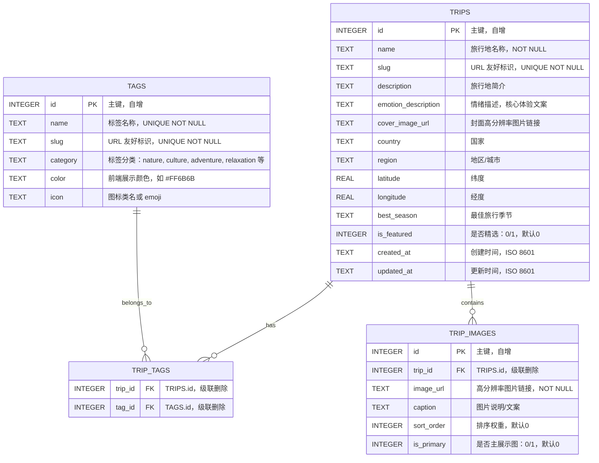

# 100种不可思议旅行 - 后端架构设计文档

## 1. 设计概览 (SDD Overview)

本文档采用 **Spec-Driven Development (SDD)** 模式，定义 "100种不可思议旅行" Web App MVP 的底层数据规范与接口契约。

| 项 | 说明 |
|---|---|
| 开发模式 | SDD (Spec-Driven Development) |
| 后端框架 | Python FastAPI |
| 数据库 | SQLite (单文件，适合 MVP 阶段) |
| 文档作用 | 作为前后端联调与业务代码实现的唯一可信数据源 |

---

## 2. 数据库设计 (SQLite Schema)

### 2.1 ER 图 (Mermaid)



### 2.2 建表 SQL（规范参考）

> **注**：以下 SQL 仅作为 Schema 规范的精确表达，**不执行**，实际建表由 ORM/Alembic 迁移脚本在后续开发阶段完成。

```sql
-- ============================================
-- 旅行地主表
-- ============================================
CREATE TABLE trips (
    id              INTEGER PRIMARY KEY AUTOINCREMENT,
    name            TEXT    NOT NULL,
    slug            TEXT    NOT NULL UNIQUE,
    description     TEXT,
    emotion_description TEXT,
    cover_image_url TEXT,
    country         TEXT,
    region          TEXT,
    latitude        REAL,
    longitude       REAL,
    best_season     TEXT,
    is_featured     INTEGER DEFAULT 0 CHECK(is_featured IN (0, 1)),
    created_at      TEXT    DEFAULT (datetime('now')),
    updated_at      TEXT    DEFAULT (datetime('now'))
);

CREATE INDEX idx_trips_slug       ON trips(slug);
CREATE INDEX idx_trips_featured   ON trips(is_featured);
CREATE INDEX idx_trips_country    ON trips(country);

-- ============================================
-- 标签字典表
-- ============================================
CREATE TABLE tags (
    id       INTEGER PRIMARY KEY AUTOINCREMENT,
    name     TEXT    NOT NULL UNIQUE,
    slug     TEXT    NOT NULL UNIQUE,
    category TEXT,
    color    TEXT,
    icon     TEXT
);

CREATE INDEX idx_tags_slug     ON tags(slug);
CREATE INDEX idx_tags_category ON tags(category);

-- ============================================
-- 旅行地-标签 多对多关联表
-- ============================================
CREATE TABLE trip_tags (
    trip_id INTEGER NOT NULL,
    tag_id  INTEGER NOT NULL,
    PRIMARY KEY (trip_id, tag_id),
    FOREIGN KEY (trip_id) REFERENCES trips(id) ON DELETE CASCADE,
    FOREIGN KEY (tag_id)  REFERENCES tags(id)  ON DELETE CASCADE
);

CREATE INDEX idx_triptags_trip ON trip_tags(trip_id);
CREATE INDEX idx_triptags_tag  ON trip_tags(tag_id);

-- ============================================
-- 旅行地图片集（支持每个目的地多张高清图）
-- ============================================
CREATE TABLE trip_images (
    id           INTEGER PRIMARY KEY AUTOINCREMENT,
    trip_id      INTEGER NOT NULL,
    image_url    TEXT    NOT NULL,
    caption      TEXT,
    sort_order   INTEGER DEFAULT 0,
    is_primary   INTEGER DEFAULT 0 CHECK(is_primary IN (0, 1)),
    FOREIGN KEY (trip_id) REFERENCES trips(id) ON DELETE CASCADE
);

CREATE INDEX idx_tripimages_trip ON trip_images(trip_id);
```

### 2.3 字段详细说明

| 表 | 字段 | 类型 | 约束 | 业务说明 |
|---|---|---|---|---|
| `trips` | `id` | INTEGER | PK, AUTOINCREMENT | 主键 |
| `trips` | `name` | TEXT | NOT NULL | 旅行地中文/英文名称，如"冰岛蓝湖" |
| `trips` | `slug` | TEXT | UNIQUE, NOT NULL | URL 标识，如 `iceland-blue-lagoon` |
| `trips` | `description` | TEXT | — | 一句话简介（≤200 字） |
| `trips` | `emotion_description` | TEXT | — | **核心字段**：情绪/体验描述文案，如"在硫磺与蒸汽中感受地球的呼吸" |
| `trips` | `cover_image_url` | TEXT | — | 封面图 CDN 高分辨率链接 |
| `trips` | `country` | TEXT | — | 国家，用于区域筛选 |
| `trips` | `region` | TEXT | — | 地区/城市 |
| `trips` | `latitude` | REAL | — | GPS 纬度，用于地图展示 |
| `trips` | `longitude` | REAL | — | GPS 经度 |
| `trips` | `best_season` | TEXT | — | 最佳旅行季节，如"11月-3月" |
| `trips` | `is_featured` | INTEGER | DEFAULT 0 | 是否首页精选推荐 |
| `trips` | `created_at` / `updated_at` | TEXT | — | ISO 8601 格式时间戳 |
| `tags` | `id` | INTEGER | PK, AUTOINCREMENT | 主键 |
| `tags` | `name` | TEXT | UNIQUE, NOT NULL | 标签名称，如"极光"、"海岛"、"徒步" |
| `tags` | `slug` | TEXT | UNIQUE, NOT NULL | URL 标识，如 `aurora` |
| `tags` | `category` | TEXT | — | 标签分类，前端可按类别分组展示 |
| `tags` | `color` | TEXT | — | 前端 UI 色值 |
| `tags` | `icon` | TEXT | — | 图标标识或 Emoji |
| `trip_tags` | `trip_id` / `tag_id` | INTEGER | PK, FK, CASCADE | 多对多关联 |
| `trip_images` | `id` | INTEGER | PK, AUTOINCREMENT | 主键 |
| `trip_images` | `trip_id` | INTEGER | FK, NOT NULL | 关联旅行地 |
| `trip_images` | `image_url` | TEXT | NOT NULL | 高清图 CDN 链接 |
| `trip_images` | `caption` | TEXT | — | 图片配文 |
| `trip_images` | `sort_order` | INTEGER | DEFAULT 0 | 轮播/画廊排序 |
| `trip_images` | `is_primary` | INTEGER | DEFAULT 0 | 是否设为详情页首图 |

---

## 3. FastAPI 路由接口契约

### 3.1 接口总览

| 方法 | 路径 | 说明 | 响应模型 |
|---|---|---|---|
| `GET` | `/api/trips` | 旅行地列表（支持筛选、分页、排序） | `TripListResponse` |
| `GET` | `/api/trips/{slug}` | 旅行地详情 | `TripDetailResponse` |
| `GET` | `/api/tags` | 全部标签列表 | `TagListResponse` |
| `GET` | `/api/tags/{slug}/trips` | 指定标签下的旅行地 | `TripListResponse` |
| `GET` | `/api/featured` | 首页精选旅行地 | `TripListResponse` |

> **设计原则**：MVP 阶段仅开放只读查询接口（`GET`），数据初始化由后台脚本/种子文件完成，暂不提供增删改接口。

### 3.2 接口详细契约

#### `GET /api/trips` — 旅行地列表

**Query Parameters**

| 参数 | 类型 | 必填 | 默认值 | 说明 |
|---|---|---|---|---|
| `page` | int | 否 | 1 | 页码，≥1 |
| `page_size` | int | 否 | 12 | 每页条数，范围 1-50 |
| `tags` | str | 否 | — | 标签筛选，支持多选，逗号分隔 slug，如 `aurora,island` |
| `country` | str | 否 | — | 按国家筛选 |
| `search` | str | 否 | — | 模糊搜索（匹配 `name`、`description`、`emotion_description`） |
| `sort` | str | 否 | `created_at` | 排序字段：`created_at` / `name` / `is_featured` |
| `order` | str | 否 | `desc` | 排序方向：`asc` / `desc` |

**Success Response: `200 OK`**

```json
{
  "items": [
    {
      "id": 1,
      "name": "冰岛蓝湖",
      "slug": "iceland-blue-lagoon",
      "description": "火山岩环绕的地热温泉，奶蓝色的水面上升腾着朦胧蒸汽。",
      "emotion_description": "在硫磺与蒸汽中感受地球的呼吸",
      "cover_image_url": "https://cdn.example.com/images/iceland-blue-lagoon-4k.jpg",
      "country": "冰岛",
      "region": "格林达维克",
      "latitude": 63.8804,
      "longitude": -22.4495,
      "best_season": "9月-次年5月",
      "tags": [
        { "id": 1, "name": "温泉", "slug": "hotspring", "color": "#4ECDC4", "icon": "♨️" },
        { "id": 2, "name": "极光", "slug": "aurora", "color": "#A8E6CF", "icon": "🌌" }
      ],
      "created_at": "2026-04-27T10:00:00Z"
    }
  ],
  "total": 100,
  "page": 1,
  "page_size": 12,
  "pages": 9
}
```

---

#### `GET /api/trips/{slug}` — 旅行地详情

**Path Parameters**

| 参数 | 类型 | 必填 | 说明 |
|---|---|---|---|
| `slug` | str | 是 | 旅行地 URL 标识 |

**Success Response: `200 OK`**

```json
{
  "id": 1,
  "name": "冰岛蓝湖",
  "slug": "iceland-blue-lagoon",
  "description": "火山岩环绕的地热温泉...",
  "emotion_description": "在硫磺与蒸汽中感受地球的呼吸",
  "cover_image_url": "https://cdn.example.com/images/iceland-blue-lagoon-4k.jpg",
  "country": "冰岛",
  "region": "格林达维克",
  "latitude": 63.8804,
  "longitude": -22.4495,
  "best_season": "9月-次年5月",
  "tags": [
    { "id": 1, "name": "温泉", "slug": "hotspring", "color": "#4ECDC4", "icon": "♨️" },
    { "id": 2, "name": "极光", "slug": "aurora", "color": "#A8E6CF", "icon": "🌌" }
  ],
  "images": [
    {
      "id": 1,
      "image_url": "https://cdn.example.com/images/iceland-1-4k.jpg",
      "caption": "黄昏时分的蓝湖",
      "sort_order": 0,
      "is_primary": 1
    }
  ],
  "created_at": "2026-04-27T10:00:00Z",
  "updated_at": "2026-04-27T10:00:00Z"
}
```

**Error Responses**

| 状态码 | 说明 |
|---|---|
| `404 Not Found` | 旅行地不存在 |

---

#### `GET /api/tags` — 标签列表

**Query Parameters**

| 参数 | 类型 | 必填 | 默认值 | 说明 |
|---|---|---|---|---|
| `category` | str | 否 | — | 按分类筛选，如 `nature`、`culture` |

**Success Response: `200 OK`**

```json
{
  "items": [
    {
      "id": 1,
      "name": "温泉",
      "slug": "hotspring",
      "category": "nature",
      "color": "#4ECDC4",
      "icon": "♨️",
      "trip_count": 8
    }
  ],
  "total": 24
}
```

---

#### `GET /api/tags/{slug}/trips` — 标签下旅行地

**Path Parameters**

| 参数 | 类型 | 必填 | 说明 |
|---|---|---|---|
| `slug` | str | 是 | 标签 URL 标识 |

**Query Parameters**

与 `GET /api/trips` 一致（`tags` 参数由路径固定，不可再传）。

**Success Response: `200 OK`**

同 `GET /api/trips` 响应结构。

**Error Responses**

| 状态码 | 说明 |
|---|---|
| `404 Not Found` | 标签不存在 |

---

#### `GET /api/featured` — 首页精选

**Query Parameters**

| 参数 | 类型 | 必填 | 默认值 | 说明 |
|---|---|---|---|---|
| `limit` | int | 否 | 6 | 返回数量，范围 1-20 |

**Success Response: `200 OK`**

```json
{
  "items": [
    {
      "id": 1,
      "name": "冰岛蓝湖",
      "slug": "iceland-blue-lagoon",
      "emotion_description": "在硫磺与蒸汽中感受地球的呼吸",
      "cover_image_url": "https://cdn.example.com/images/iceland-blue-lagoon-4k.jpg",
      "country": "冰岛",
      "tags": [
        { "id": 2, "name": "极光", "slug": "aurora", "color": "#A8E6CF", "icon": "🌌" }
      ]
    }
  ],
  "total": 6
}
```

---

## 4. Pydantic 响应模型规范（契约参考）

> **注**：以下模型定义仅作为接口契约的精确表达，供前后端联调与代码实现时引用，**不生成实际代码文件**。

```python
# 以下为契约参考，用于统一前后端对数据结构的理解

class TagBrief(BaseModel):
    id: int
    name: str
    slug: str
    color: str | None
    icon: str | None

class TagDetail(TagBrief):
    category: str | None
    trip_count: int

class TripImage(BaseModel):
    id: int
    image_url: str
    caption: str | None
    sort_order: int
    is_primary: bool

class TripListItem(BaseModel):
    id: int
    name: str
    slug: str
    description: str | None
    emotion_description: str | None
    cover_image_url: str | None
    country: str | None
    region: str | None
    latitude: float | None
    longitude: float | None
    best_season: str | None
    tags: list[TagBrief]
    created_at: str  # ISO 8601

class TripDetail(TripListItem):
    images: list[TripImage]
    updated_at: str  # ISO 8601

class PaginatedResponse(BaseModel):
    items: list
    total: int
    page: int
    page_size: int
    pages: int
```

---

## 5. 设计决策记录 (ADR)

### ADR-1: 为什么使用 SQLite？

- **MVP 阶段数据量可控**：100 条旅行地数据 + 少量标签，SQLite 单文件完全胜任。
- **零运维成本**：无需额外部署数据库服务，降低项目启动门槛。
- **迁移路径清晰**：后续若需切换 PostgreSQL，SQLAlchemy 等 ORM 可平滑迁移，业务代码无需改动。

### ADR-2: 为什么 `slug` 作为主查询键？

- 旅行地详情页 URL 为 `/trip/iceland-blue-lagoon`，使用 `slug` 更符合 RESTful 语义与 SEO 需求。
- 内部关联仍使用自增 `id`，保持外键紧凑高效。

### ADR-3: 为什么 emotion_description 单独成字段？

- 该字段是产品核心卖点（情绪价值文案），与客观 `description` 分离便于：
  1. 前端独立样式渲染（更大字号、情绪化排版）
  2. 后续 A/B 测试替换文案而不影响基础数据

### ADR-4: 为什么 MVP 阶段只提供 GET 接口？

- 数据初始化由种子脚本或后台 SQL 完成，前端为纯展示型应用。
- 减少攻击面，无需处理认证/授权/输入校验等复杂性。
- 后续如需 CMS 管理后台，可独立迭代增删改接口。

---

## 6. 待办与后续迭代

| 阶段 | 内容 | 优先级 |
|---|---|---|
| P0 | 根据本文档实现 FastAPI 路由与 SQLAlchemy Model | 必需 |
| P0 | 编写数据种子脚本（Seed Data）初始化 100 条旅行地 | 必需 |
| P1 | 图片 CDN 接入或转存方案（如 Cloudflare R2 / 阿里云 OSS） | 推荐 |
| P1 | 接口缓存层（如 `fastapi-cache` + Redis） | 可选 |
| P2 | 管理后台增删改接口 + JWT 认证 | 后续迭代 |
| P2 | 数据库迁移至 PostgreSQL（数据量增长后） | 后续迭代 |

---

## 7. 版本记录

| 版本 | 日期 | 说明 |
|---|---|---|
| v1.0 | 2026-04-27 | 初始架构设计，含 Schema、API 契约、ER 图 |
